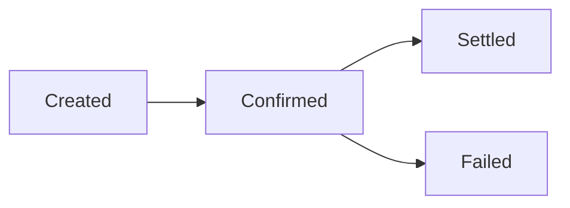

Every payout processed by Trio goes through a sequence of stages that represent the transaction lifecycle in our system.

### Transaction Statuses

* **Created** — The transaction was received and queued for processing.
* **Confirmed** — The settlement process has started.
* **Settled** — The transaction was successfully processed and settled. The balance is deducted from your account. This is a final status.
* **Failed** — The transaction could not be processed due to invalid information or because it was rejected by the bank. This is a final status.

### Transaction Flow

The following diagram illustrates the transaction flow:

**Final statuses:** `Settled` and `Failed`.

Once a payout reaches a final status, its lifecycle is complete.
